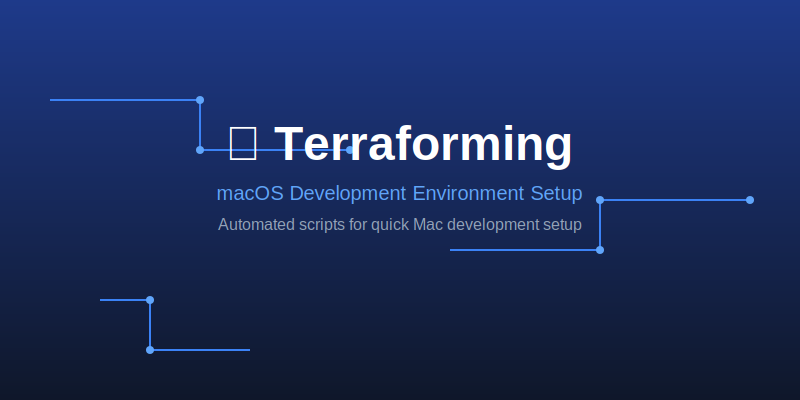

# 🚀 Terraforming

> macOS 개발 환경 자동 설정 스크립트



## 포함 내용

**개발 도구**: iTerm2, VS Code, IntelliJ, Git, Fork, Docker, pyenv, nvm  
**앱**: Chrome, Obsidian, Notion, Raycast, 1Password, Claude Code, ChatGPT  
**터미널**: Zsh + Oh My Zsh + Powerlevel10k + 플러그인들  
**유틸**: Dozer, eza, fzf, Hack 폰트

## 사용법

```bash
chmod +x *.sh
./setup.sh
```

개별 실행:
- `./setup_brew.sh` - Homebrew + 패키지 설치
- `./setup_zsh.sh` - Zsh + Oh My Zsh + 테마
- `./setup_git.sh` - Git 설정
- `./install_zsh_plugin.sh` - Zsh 플러그인
- `./install_dozer.sh` - Dozer 앱 설치